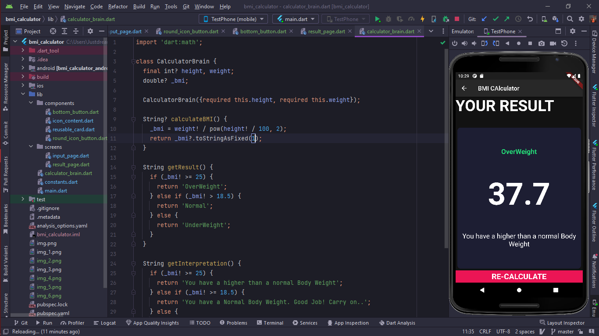

# bmi_calculator

A new Body Max Index Calculation Flutter project.

## Getting Started

This project is a starting point for a Flutter application.

In second step I able to design app structure fully from scratch, create a class for separating
constant values from main code.

add icons for male female gender with using constructor and re factored all code in each of separate
class.. and create a new customized Widget !!!

finally got the full design and its functionality.. and it can perform to switch one to another
screen with all data..

after pressing RE_CALCULATE-
give some input

wow! its OVER WEIGHT...

